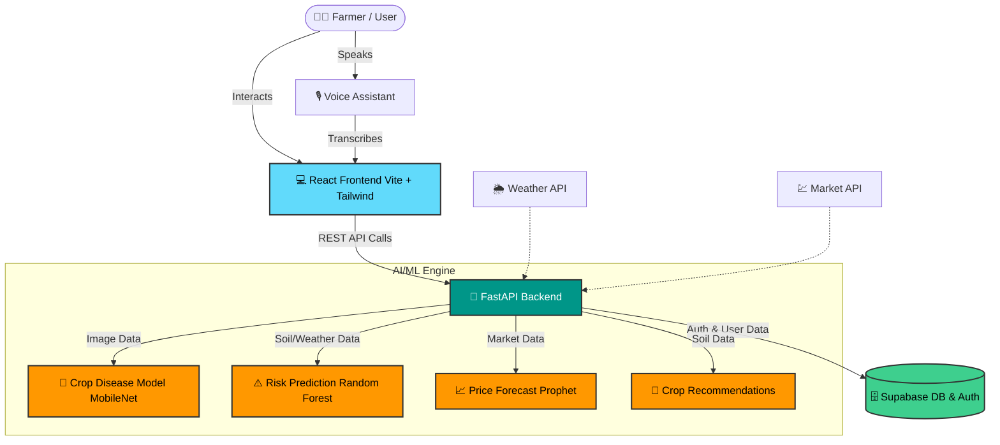

<div align="center">
  
  
  
  
  
  <br>
  <h1>🌾 SAGRI (Krishi Shayak)</h1>
  <h3>Smart Agriculture Real-time Intelligence</h3>
  <p>An advanced AI-powered farming assistant empowering farmers with data-driven insights.</p>
</div>

---

## 📖 About The Project

**SAGRI (Krishi Shayak)** brings modern technology to the roots of agriculture. By leveraging cutting-edge Artificial Intelligence and Machine Learning, SAGRI provides actionable insights to farmers, helping them mitigate risks, prevent crop diseases, and make informed financial decisions. 

Whether it's identifying a plant disease from a single photo or predicting market prices for the next harvest, SAGRI is designed to be the ultimate digital companion for the modern farmer.

## ✨ Core Features

*   **🔬 Crop Disease Detection:** Instant diagnosis of plant health through advanced computer vision image analysis.
*   **⚠️ Risk Prediction:** AI-driven assessment of crop failure risks based on real-time environmental and soil data.
*   **📈 Price Forecasting:** Market trend analysis and future price predictions to maximize profitability.
*   **🌱 Smart Recommendations:** Tailored crop suggestions optimized for specific soil health and weather conditions.
*   **🌍 Multi-language Support:** Completely accessible in English, Hindi, and Punjabi to bridge the language barrier.
*   **🎙️ Voice Assistant:** Integrated voice navigation for hands-free and improved accessibility.

## 🛠️ Tech Stack

### Frontend


### Backend & AI


### Database & Auth


---

## 🏗️ System Architecture



---

## 📦 Directory Structure

```text
SAGRI/
├── backend/                  # Python FastAPI Backend
│   ├── models/               # Pre-trained AI Models (.pkl, .keras, .h5)
│   ├── routers/              # API Route definitions
│   ├── core/                 # App configurations and security
│   └── main.py               # FastAPI application entry point
├── src/                      # React Frontend Source (Vite)
│   ├── components/           # Reusable UI components
│   ├── pages/                # Application views (Dashboard, Login, etc.)
│   ├── contexts/             # React Contexts (Language, Auth)
│   └── assets/               # Images, icons, and styles
├── ml_training_scripts/      # Jupyter notebooks & Python scripts for model training
├── docs/                     # Detailed technical guides and API documentation
└── setup_all.py              # Automated unified installation script
```

---

## 🚀 Getting Started

Follow these instructions to get a copy of the project up and running on your local machine for development and testing purposes.

### Prerequisites

Ensure you have the following installed:
- [Node.js](https://nodejs.org/) (v16.x or later)
- [Python](https://www.python.org/) (v3.10 or later)
- [Git](https://git-scm.com/)

### 🛠️ One-Click Installation

For a seamless setup experience, run the automated setup script from the root directory:

```bash
python setup_all.py
```
*This script will automatically set up virtual environments, install dependencies for both frontend and backend, and prepare the project.*

### ⚙️ Manual Installation

If you prefer to set up the environments manually, follow these steps:

#### 1. Clone the repository
```bash
git clone https://github.com/AyushGU12/sagri_final.git
cd sagri_final
```

#### 2. Backend Setup
```bash
cd backend
# Create virtual environment
python -m venv venv

# Activate virtual environment
# Windows:
venv\Scripts\activate
# Linux/Mac:
source venv/bin/activate

# Install dependencies
pip install -r requirements.txt

# Start the FastAPI server
uvicorn main:app --reload
```
*The backend API will run on `http://localhost:8000`*

#### 3. Frontend Setup
Open a new terminal window/tab:
```bash
# From the root directory, install NPM packages
npm install

# Start the Vite development server
npm run dev
```
*The React app will be available at `http://localhost:5173`*

---

## 🧠 Machine Learning Models

SAGRI relies on several sophisticated ML models:
- **MobileNetV2 (TensorFlow/Keras):** Utilized for the Crop Disease Detection module, offering high accuracy image classification with low latency.
- **Random Forest Classifier (Scikit-learn):** Analyzes multidimensional environmental data (humidity, temperature, soil pH) to predict crop failure risks.
- **Prophet (Meta):** Time-series forecasting model used to predict future market prices for various commodities.

---

## 🤝 Contributing

Contributions are what make the open-source community such an amazing place to learn, inspire, and create. Any contributions you make are **greatly appreciated**.

1. Fork the Project
2. Create your Feature Branch (`git checkout -b feature/AmazingFeature`)
3. Commit your Changes (`git commit -m 'Add some AmazingFeature'`)
4. Push to the Branch (`git push origin feature/AmazingFeature`)
5. Open a Pull Request

---

## 📄 License

Distributed under the MIT License. See `LICENSE` for more information.

---
<div align="center">
  <b>Made with ❤️ for Indian Farmers</b>
</div>