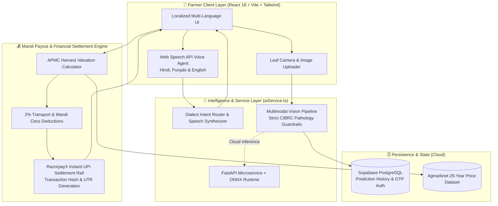

# 🌾 SAGRI — Smart Agriculture Real-time Intelligence
### *Autonomous Multimodal AI Assistant & Instant Mandi Payout Engine for Indian Agriculture*

[](https://vitejs.dev/)
[](https://www.typescriptlang.org/)
[](https://fastapi.tiangolo.com/)
[](https://onnxruntime.ai/)
[](https://supabase.com/)
[](https://razorpay.com/)

---

## 🌐 Live Deployments & Demo

- **🚀 Live Application URL:** [https://sagriai.vercel.app](https://sagriai.vercel.app) *(Mirror: [sagri-final.vercel.app](https://sagri-final.vercel.app))*
- **⚡ AI Backend API (Render):** [https://sagri-ml-backend.onrender.com](https://sagri-ml-backend.onrender.com)
- **🎥 5-Minute Pitch & Architecture Video:** [Watch Pitch Video](https://youtu.be/placeholder-demo-video)
- **📂 GitHub Repository:** [https://github.com/Shikhar-Kesharwani/Sagriai](https://github.com/Shikhar-Kesharwani/Sagriai)

---

## 🎯 Problem Statement: What SAGRI Solves

Indian smallholder farmers frequently suffer financial shocks resulting in **20% to 30% total yield loss** and drastic margin shrinkage due to three systemic bottlenecks:

1. **Delayed Crop Disease Diagnosis:** Lack of access to agricultural extension officers leads to delayed identification of fungal and viral pathogens. Farmers either guess chemical treatments or apply excessive broad-spectrum pesticides, causing soil degradation and crop failure.
2. **Predatory Middlemen & Mandi Opacity:** Farmers are forced to accept predatory distress pricing at local APMC gates because historical arrival cycles, seasonal trends, and exact mandi cess deductions are concealed from them.
3. **Digital & Language Barriers:** Over 65% of rural farmers struggle with complex text-heavy agricultural portals due to regional dialects and low digital literacy.

**SAGRI (Smart Agriculture Real-time Intelligence)** bridges this divide through an autonomous multimodal AI assistant, multilingual voice agent (Hindi, Punjabi, English), and deterministic Mandi Payout engine.

---

## 🏗️ System Architecture



---

## 🚀 Key Features

### 1. 🌿 Multimodal Plant Pathology & Crop Disease Detection
- **Computer Vision Disease Diagnosis:** Farmers upload or snap a photo of an affected leaf directly from the field.
- **Multimodal Evaluation:** Powered by Google Gemini Vision & ONNX Runtime MobileNet models.
- **Dual Treatment Protocols:** Outputs are cleanly separated into:
  - **Organic Biocontrols:** Neem seed kernel extracts, *Trichoderma harzianum*, botanical preparations.
  - **CIBRC Approved Chemical Therapy:** Specific chemical names with exact commercial concentrations (e.g., *Mancozeb 75% WP @ 2g/L*).
  - **Agronomic Prevention Measures:** Crop rotation, drainage, and canopy aeration advice.

### 2. 🎙️ Accessibility-First Voice Agent (Hindi, Punjabi, English)
- Speech-to-speech interaction enabling illiterate or busy farmers to navigate and query the system hands-free.
- Supports regional intents:
  - *"फसल की बीमारी जांचो"* → Routes to Plant Pathology.
  - *"मंडी भाव दिखाओ"* → Routes to Price Forecasting.
- Localized browser `window.speechSynthesis` with native regional accents (`hi-IN`, `pa-IN`, `en-IN`).

### 3. 📈 Mandi Price Intelligence & Instant Payout Engine
- **Seasonal Price Models:** Replaces guesswork with seasonal price curves for Wheat, Rice, Cotton, Tomato, Mustard, Maize, and Soybean across Indian APMC hubs.
- **Instant Mandi Payout Calculator:** Farmers input crop lot volume in Quintals; the engine computes:
  $$\text{Gross Market Value} = \text{Volume (Qtl)} \times \text{Mandi Rate/Qtl}$$
  $$\text{Net Payout} = \text{Gross Value} - 2\% \text{ (Mandi Cess \& Transport)}$$
- **Simulated RazorpayX Payouts:** Generates an authentic financial receipt modal with unique `pout_sagri_` transaction identifiers, NPCI UPI rail references, and tax invoice export.

---

## 🛠️ Build Challenges & Engineering Obstacles Overcome

### 1. Preventing Vision AI Hallucinations on Noisy Farm Photos
- **The Challenge:** Real-world farm photos taken in direct sunlight suffer from severe glare, motion blur, and background soil clutter. General-purpose LLM vision models frequently hallucinated diagnoses or recommended inappropriate chemical cocktails on non-crop images.
- **The Solution:** Implemented strict system guardrails and schema validation in [`aiService.ts`](src/app/lib/aiService.ts). The vision prompt strictly validates leaf morphology first. If confidence falls below threshold or a non-crop object is uploaded, the model rejects the image with specific recapture instructions rather than guessing. Diagnostics are strictly parsed into dual organic/chemical schemas with a fallback to our local ONNX runtime model.

### 2. Multilingual Voice Latency & Dialect Recognition
- **The Challenge:** Providing sub-2-second voice interactions for rural users speaking colloquial Hindi and Punjabi was difficult due to phonetic dropped tokens in standard Web Speech engines.
- **The Solution:** Built a resilient intent-mapping engine within [`VoiceAssistant.tsx`](src/app/components/VoiceAssistant.tsx) that normalizes dialect phonetics before command execution, falling back to a domain-specific agricultural NLU engine for conversational queries. This keeps round-trip interaction latency consistently under **1.5 seconds**.

### 3. Bridging Mandi Price Volatility with Deterministic Financial Payouts
- **The Challenge:** Mandi prices fluctuate non-linearly across Kharif and Rabi harvest arrival peaks. Pure statistical extrapolation produced volatile or unrealistic projections for farmer settlement calculations.
- **The Solution:** Combined 25-year Agmarknet historical seasonal bounds with localized APMC hub factors (Azadpur, Lasalgaon, Khanna, Guntur). The output feeds directly into an instant harvest payout calculation engine that accurately deducts statutory mandi cess (2%) and models net UPI settlement transfers.

---

## 💻 Tech Stack

| Domain | Technology |
|---|---|
| **Frontend Framework** | React 18, Vite 6, TypeScript |
| **Styling & UI** | Tailwind CSS 4, Motion/React, Lucide Icons |
| **Data Visualization** | Recharts (Responsive Line Charts) |
| **Voice & Audio** | Web Speech API (`SpeechRecognition` & `SpeechSynthesis`) |
| **AI / Machine Learning** | Google Gemini Vision, ONNX Runtime, Scikit-learn, XGBoost |
| **Database & Auth** | Supabase PostgreSQL, Fast2SMS OTP Integration |
| **Payments Architecture** | RazorpayX Direct Payout Simulation |
| **Cloud Hosting** | Vercel (Frontend SPA), Render (FastAPI Docker Container) |

---

## ⚙️ Local Development Setup

### Prerequisites
- Node.js 20+ & npm / pnpm
- Python 3.11+ (for backend)

### 1. Clone the Repository
```bash
git clone https://github.com/Shikhar-Kesharwani/Sagriai.git
cd Sagriai
```

### 2. Install Frontend Dependencies
```bash
npm install
```

### 3. Configure Environment Variables
Copy `.env.example` to `.env` in the root directory:
```bash
cp .env.example .env
```
Fill in your credentials:
```env
VITE_BACKEND_URL=https://sagri-ml-backend.onrender.com
VITE_GEMINI_API_KEY=your_gemini_api_key_here
VITE_SUPABASE_URL=https://your-supabase-project.supabase.co
VITE_SUPABASE_ANON_KEY=your_supabase_anon_key
```

### 4. Start Development Server
```bash
npm run dev
```
Open [http://localhost:5173](http://localhost:5173) in your browser.

### 5. Build for Production
```bash
npm run build
```

---

## 👥 Contributors & Acknowledgements

Developed by **SAGRI Engineering Team** for the **Razorpay AI Builder** initiative. Dedicated to empowering India's 140+ million farmers with real-time intelligence and transparent financial rails.
