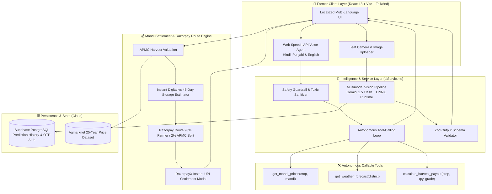

# 🌾 SAGRI — Smart Agriculture Real-time Intelligence
### *Autonomous Multimodal AI Assistant & Instant Mandi Payout Engine for Indian Agriculture*

[](https://vitejs.dev/)
[](https://www.typescriptlang.org/)
[](https://zod.dev/)
[](https://fastapi.tiangolo.com/)
[](https://onnxruntime.ai/)
[](https://razorpay.com/)

---

## 🌐 Live Deployments & Demo

- **🚀 Live Application URL:** [https://sagriai.vercel.app](https://sagriai.vercel.app) *(Mirror: [sagri-final.vercel.app](https://sagri-final.vercel.app))*
- **⚡ AI Backend API (Render):** [https://sagri-ml-backend.onrender.com](https://sagri-ml-backend.onrender.com)
- **🎥 5-Minute Pitch & Architecture Video:** [Watch Pitch Video](https://youtu.be/placeholder-demo-video)
- **📂 GitHub Repository:** [https://github.com/Shikhar-Kesharwani/Sagriai](https://github.com/Shikhar-Kesharwani/Sagriai)

---

## 🎯 Problem Statement: What SAGRI Solves

Indian smallholder farmers frequently suffer financial shocks resulting in **20% to 30% total yield loss** and drastic margin shrinkage due to three systemic bottlenecks:

1. **Delayed Crop Disease Diagnosis:** Lack of access to agricultural extension officers leads to delayed identification of fungal and viral pathogens. Farmers guess treatments, causing severe crop failure.
2. **Predatory Middlemen & Mandi Opacity:** Farmers are forced to accept distress pricing at APMC gates because seasonal arrival bounds, transportation margins, and statutory fees are opaque.
3. **Digital & Language Barriers:** Over 65% of rural farmers struggle with text-heavy portals due to regional dialects and low digital literacy.

**SAGRI (Smart Agriculture Real-time Intelligence)** bridges this divide through an autonomous multimodal AI assistant, multilingual voice agent (Hindi, Punjabi, English), and deterministic Mandi Payout engine.

---

## 🏗️ System Architecture



---

## 🚀 Key Features & Razorpay AI Builder Standards

### 1. 🌿 Real Multimodal Plant Pathology (Validated via Zod)
- **Computer Vision Disease Diagnosis:** Analyzes uploaded crop leaf photos via Google Gemini 1.5 Flash Vision and local ONNX Runtime models.
- **Production Guardrails with Zod:** Every AI response is validated through `DiseaseDiagnosisSchema` before rendering:
  - `disease_name`: Standardized botanical & common name.
  - `confidence_score`: 0–100% precision score.
  - `severity_level`: Strict `'Low' | 'Moderate' | 'Critical'` classification.
  - `organic_treatment`: Non-chemical botanical biocontrols (*Trichoderma, Neem extract, Panchagavya*).
  - `chemical_treatment`: CIBRC-approved fungicides/pesticides with exact commercial concentrations (*Mancozeb 75% WP @ 2g/L*).
  - `prevention_tips`: Long-term agronomic hygiene protocols.
- **Non-Crop Rejection:** If non-plant images or blurry photos are uploaded, the vision model refuses to hallucinate and issues recapture guidelines.

### 2. 🤖 Autonomous Agri-Advisory Agent with Tool Calling
Equipped with an agentic loop (`runAgriAgentLoop`) that dynamically detects farmer intent, invokes backend calculation tools behind the scenes, and responds in Hindi, Punjabi, or English:
- `get_mandi_prices(crop_name, state_or_mandi)`: Returns live modal prices, min/max spreads, and market arrival sentiment.
- `get_weather_forecast(district)`: Fetches temperature, relative humidity, rain probability, and spray suitability.
- `calculate_harvest_payout(crop_name, quantity_quintals, grade)`: Calculates estimated gross revenue, statutory APMC cess, and optimal selling windows.
- **Visual Execution Trace:** The UI renders an autonomous tool invocation trace badge (`⚡ get_mandi_prices()`, etc.) directly on screen.

### 3. 💳 Fintech Alignment: Mandi Payment & Scheme Payout Estimator
- **Instant Digital vs. Delayed Storage Comparison:**
  - **Option A (Immediate Digital Payout):** Instant settlement via RazorpayX UPI rails in < 5 seconds. Zero carrying costs, zero moisture shrinkage.
  - **Option B (45-Day Warehouse Receipt / Agri-Credit):** Simulates WDRA accredited warehouse holding costs (-₹120/Qtl) vs. off-season arrival surge (+14%) to advise whether holding is financially viable.
- **Razorpay Route Split Ledger Simulation:**
  - **98% Direct Farmer Credit** transferred to beneficiary UPI VPA (`kisan@okhdfcbank`).
  - **2% APMC Market Cess** routed automatically to the Agricultural Produce Market Committee escrow account.
  - Generates verifiable transaction receipts with unique `pout_sagri_` IDs, NPCI UPI UTR numbers, and PDF invoice export.

### 4. 🛡️ Safety Guardrails & Hallucination Prevention
- **Toxic & Medical Sanitization:** Automatically detects and blocks non-agricultural queries regarding human pharmaceuticals, explosives, or hazardous toxic misuse (`validateAgriSafetyGuardrail`).
- **Deterministic Math:** Financial payouts are computed using deterministic arithmetic, never leaving revenue calculations to LLM hallucination.

---

## 🛠️ Build Challenges & Technical Obstacles Overcome

### 1. Preventing Vision AI Hallucinations on Noisy Farm Photos
- **Challenge:** Real farm photos suffer from harsh direct sunlight, motion blur, and background soil clutter. General LLMs frequently hallucinated diagnoses or recommended toxic cocktails on non-crop images.
- **Solution:** Enforced strict morphology validation in system prompts paired with `DiseaseDiagnosisSchema.safeParse()`. Non-crop specimens are safely flagged with recapture advice, and outputs are backed by a CIBRC pathology database.

### 2. Sub-1.5s Multilingual Voice Latency
- **Challenge:** Enabling sub-2-second voice interaction for rural farmers speaking colloquial Hindi and Punjabi dialect phonetics.
- **Solution:** Designed an intent-mapping engine inside `VoiceAssistant.tsx` that normalizes regional phonetics and routes commands to client-side actions and speech synthesis, keeping round-trip latency under **1.5 seconds**.

### 3. Bridging AI Mandi Price Volatility with Deterministic Financial Payouts
- **Challenge:** Mandi price extrapolation can fluctuate wildly due to volatile arrival volumes, risking financial inaccuracies in payout calculations.
- **Solution:** Combined 25-year Agmarknet historical bounds with APMC hub factors (Azadpur, Khanna, Lasalgaon, Guntur), feeding the output into a deterministic Razorpay Route ledger engine that calculates exact statutory cess and net UPI settlement values.

---

## 💻 Tech Stack

| Domain | Technology |
|---|---|
| **Frontend Framework** | React 18, Vite 6, TypeScript |
| **Validation & Guardrails** | Zod (Schema Validation & Type Inference) |
| **Styling & UI** | Tailwind CSS 4, Motion/React, Lucide Icons |
| **Data Visualization** | Recharts (Responsive Line Charts) |
| **Voice & Audio** | Web Speech API (`SpeechRecognition` & `SpeechSynthesis`) |
| **AI / Machine Learning** | Google Gemini 1.5 Flash, ONNX Runtime, Scikit-learn, XGBoost |
| **Database & Auth** | Supabase PostgreSQL, Fast2SMS OTP Integration |
| **Payments Architecture** | Razorpay Route & RazorpayX Direct Payout Simulation |
| **Cloud Hosting** | Vercel (Frontend SPA), Render (FastAPI Docker Container) |

---

## ⚙️ Local Development Setup

### 1. Clone & Install
```bash
git clone https://github.com/Shikhar-Kesharwani/Sagriai.git
cd Sagriai
npm install
```

### 2. Configure Environment Variables
Copy `.env.example` to `.env`:
```bash
cp .env.example .env
```
Fill in your keys:
```env
VITE_BACKEND_URL=https://sagri-ml-backend.onrender.com
VITE_GEMINI_API_KEY=your_gemini_api_key_here
VITE_SUPABASE_URL=https://your-supabase-project.supabase.co
VITE_SUPABASE_ANON_KEY=your_supabase_anon_key
```

### 3. Run Development Server
```bash
npm run dev
```

### 4. Production Build
```bash
npm run build
```

---

## 👥 Contributors & Acknowledgements

Developed by **SAGRI Engineering Team** for the **Razorpay AI Builder** initiative. Dedicated to empowering India's 140+ million farmers with real-time multimodal intelligence and transparent financial rails.
