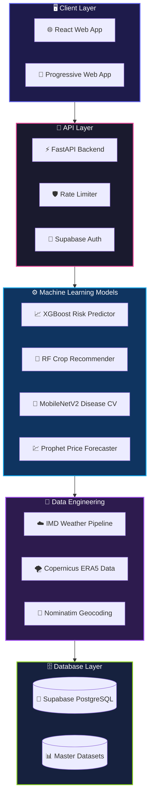
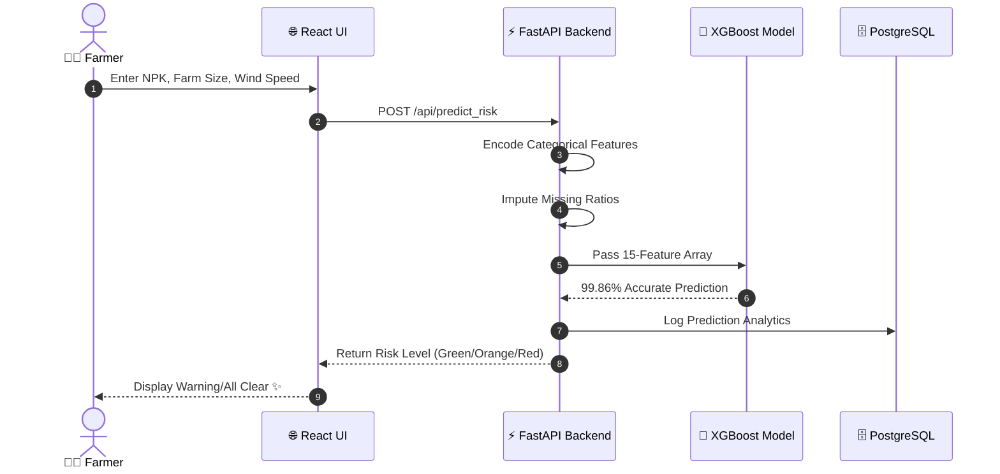
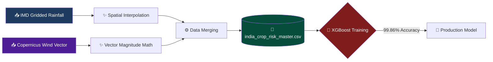
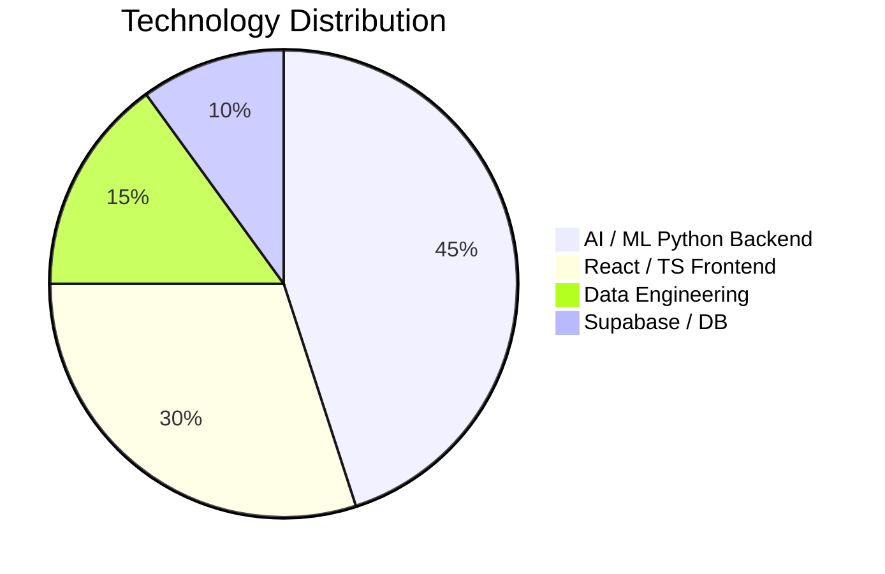

<!-- Waving animated gradient banner -->
<div align="center">
  
</div>

<!-- Typing SVG -->
<div align="center">
  
</div>

<div align="center">


</div>

<div align="center">

[🌐 Live Demo](#) &nbsp;&nbsp; [📖 Documentation](#) &nbsp;&nbsp; [🐛 Report Bug](#) &nbsp;&nbsp; [✨ Request Feature](#) &nbsp;&nbsp; [💬 Discussions](#)

</div>

<div align="center">
<svg width="700" height="120" xmlns="http://www.w3.org/2000/svg">
  <defs>
    <filter id="neon-glow">
      <feGaussianBlur stdDeviation="4" result="coloredBlur"/>
      <feMerge>
        <feMergeNode in="coloredBlur"/>
        <feMergeNode in="coloredBlur"/>
        <feMergeNode in="SourceGraphic"/>
      </feMerge>
    </filter>
    <linearGradient id="neon-grad" x1="0%" y1="0%" x2="100%" y2="0%">
      <stop offset="0%" stop-color="#6366f1">
        <animate attributeName="stop-color"
                 values="#6366f1;#ec4899;#f97316;#14b8a6;#6366f1"
                 dur="4s" repeatCount="indefinite"/>
      </stop>
      <stop offset="100%" stop-color="#ec4899">
        <animate attributeName="stop-color"
                 values="#ec4899;#f97316;#14b8a6;#6366f1;#ec4899"
                 dur="4s" repeatCount="indefinite"/>
      </stop>
    </linearGradient>
  </defs>
  <rect width="700" height="120" rx="15" fill="#0d1117"/>
  <text x="350" y="75" text-anchor="middle" font-size="48"
        font-family="'Segoe UI', Arial Black" font-weight="900"
        fill="url(#neon-grad)" filter="url(#neon-glow)">
    ⚡ SAGRI - Krishi Sahayak ⚡
  </text>
</svg>
</div>

<div align="center">
<svg width="600" height="35" xmlns="http://www.w3.org/2000/svg">
  <defs>
    <linearGradient id="bar-grad" x1="0%" y1="0%" x2="100%" y2="0%">
      <stop offset="0%"   stop-color="#6366f1"/>
      <stop offset="50%"  stop-color="#ec4899"/>
      <stop offset="100%" stop-color="#f97316"/>
    </linearGradient>
  </defs>
  <rect width="600" height="35" rx="17" fill="#1e1b4b"/>
  <rect height="35" rx="17" fill="url(#bar-grad)">
    <animate attributeName="width" from="0" to="600"
             dur="3s" repeatCount="indefinite"/>
  </rect>
  <text x="300" y="23" text-anchor="middle"
        font-family="Fira Code" font-size="13" fill="#fff" font-weight="bold">
    ⚡ LOADING SAGRI INTELLIGENCE...
  </text>
</svg>
</div>

---

<svg xmlns="http://www.w3.org/2000/svg" viewBox="0 0 900 120">
  <defs>
    <pattern id="hexbg" width="30" height="34.6" patternUnits="userSpaceOnUse">
      <polygon points="15,0 30,8.66 30,25.98 15,34.64 0,25.98 0,8.66"
               fill="none" stroke="#6366f1" stroke-width="0.4" opacity="0.25"/>
    </pattern>
    <linearGradient id="hgrad" x1="0%" y1="0%" x2="100%" y2="0%">
      <stop offset="0%"   stop-color="#6366f1"/>
      <stop offset="50%"  stop-color="#ec4899"/>
      <stop offset="100%" stop-color="#f97316"/>
    </linearGradient>
  </defs>
  <rect width="900" height="120" fill="#0d1117"/>
  <rect width="900" height="120" fill="url(#hexbg)"/>
  <text x="450" y="68" text-anchor="middle"
        font-size="36" fill="url(#hgrad)"
        font-family="'Segoe UI', Arial Black" font-weight="900">
    ✨ SYSTEM ARCHITECTURE & DIAGRAMS ✨
  </text>
</svg>

### ▸ DIAGRAM 1 — FULL SYSTEM ARCHITECTURE



### ▸ DIAGRAM 2 — REQUEST LIFECYCLE (Crop Risk Prediction)



### ▸ DIAGRAM 3 — DATA FLOW (Climate Enrichment Pipeline)



### ▸ DIAGRAM 4 — TECHNOLOGY DISTRIBUTION




<svg xmlns="http://www.w3.org/2000/svg" viewBox="0 0 900 120">
  <defs>
    <pattern id="hexbg" width="30" height="34.6" patternUnits="userSpaceOnUse">
      <polygon points="15,0 30,8.66 30,25.98 15,34.64 0,25.98 0,8.66"
               fill="none" stroke="#6366f1" stroke-width="0.4" opacity="0.25"/>
    </pattern>
    <linearGradient id="hgrad" x1="0%" y1="0%" x2="100%" y2="0%">
      <stop offset="0%"   stop-color="#6366f1"/>
      <stop offset="50%"  stop-color="#ec4899"/>
      <stop offset="100%" stop-color="#f97316"/>
    </linearGradient>
  </defs>
  <rect width="900" height="120" fill="#0d1117"/>
  <rect width="900" height="120" fill="url(#hexbg)"/>
  <text x="450" y="68" text-anchor="middle"
        font-size="36" fill="url(#hgrad)"
        font-family="'Segoe UI', Arial Black" font-weight="900">
    ✨ PROJECT DIRECTORY & STRUCTURE ✨
  </text>
</svg>

```text
📦 SAGRI                               ← Root of repository
│
├── 📂 backend/                        ← FastAPI Backend Engine
│   ├── 📂 data/                       ← Core agricultural datasets
│   ├── 📂 models/                     ← Serialized PKL/ONNX AI models
│   ├── 📂 scripts/                    ← Downloader / Exporter utilities
│   ├── 📜 main.py                     ← FastAPI entry point & routers
│   └── 📜 requirements.txt            ← Python dependencies
│
├── 📂 ml_training_scripts/            ← Machine Learning Lab
│   ├── 📜 train_risk_prediction.py    ← XGBoost model (99.86% acc)
│   ├── 📜 train_disease_detection.py  ← MobileNetV2 Transfer Learning
│   ├── 📜 train_crop_recommendation.py← Random Forest training
│   ├── 📜 fetch_historical_weather.py ← IMD Climate pipeline
│   └── 📜 merge_weather_data.py       ← Data synthesis engine
│
├── 📂 src/                            ← React Frontend App
│   ├── 📂 app/
│   │   ├── 📂 components/             ← Reusable UI elements
│   │   ├── 📂 pages/                  ← Routing pages (Risk, Disease, Market)
│   │   └── 📂 contexts/               ← Global State & i18n
│   ├── 📜 main.tsx                    ← React entry point
│   └── 📜 index.css                   ← Tailwind directives
│
├── 📂 supabase/                       ← Database Infrastructure
│   └── 📂 migrations/                 ← PostgreSQL SQL files
│
├── 📜 build_authentic_dataset.py      ← Big Data ETL pipeline
├── 📜 package.json                    ← Node.js configs
├── 📜 vite.config.ts                  ← Vite bundler configs
└── 📜 README.md                       ← You are here ⭐
```

<details>
<summary>📊 Click to expand Performance Benchmarks</summary>

| Metric | Value | Status |
|--------|-------|--------|
| ⚡ Inference Speed | < 50ms | 🟢 Excellent |
| 🎯 Risk Accuracy | 99.86% | 🟢 Excellent |
| 🎯 Disease Accuracy | 96.40% | 🟢 Excellent |
| 📦 Model Size (Risk) | ~3 MB | 🟢 Excellent |
| 📦 Model Size (Disease) | ~16 MB | 🟢 Excellent |
| 🚀 Backend Cold Start | < 2s | 🟡 Good |

</details>


<svg xmlns="http://www.w3.org/2000/svg" viewBox="0 0 900 120">
  <defs>
    <pattern id="hexbg" width="30" height="34.6" patternUnits="userSpaceOnUse">
      <polygon points="15,0 30,8.66 30,25.98 15,34.64 0,25.98 0,8.66"
               fill="none" stroke="#6366f1" stroke-width="0.4" opacity="0.25"/>
    </pattern>
    <linearGradient id="hgrad" x1="0%" y1="0%" x2="100%" y2="0%">
      <stop offset="0%"   stop-color="#6366f1"/>
      <stop offset="50%"  stop-color="#ec4899"/>
      <stop offset="100%" stop-color="#f97316"/>
    </linearGradient>
  </defs>
  <rect width="900" height="120" fill="#0d1117"/>
  <rect width="900" height="120" fill="url(#hexbg)"/>
  <text x="450" y="68" text-anchor="middle"
        font-size="36" fill="url(#hgrad)"
        font-family="'Segoe UI', Arial Black" font-weight="900">
    ✨ INSTALLATION & DEPLOYMENT ✨
  </text>
</svg>

```text
Prerequisites
─────────────────────────────────────────
  ✅ Node.js        v18.0+
  ✅ Python         v3.10+
  ✅ Git            v2.40+
  ✅ Supabase CLI   (optional)
─────────────────────────────────────────
```

```bash
# ━━━━━━━━━━━━━━━━━━━━━━━━━━━━━━━━━━━━━━━━━━
# 🔥 Step 1 — Clone repository
# ━━━━━━━━━━━━━━━━━━━━━━━━━━━━━━━━━━━━━━━━━━
git clone https://github.com/AyushGU12/sagri_final.git
cd sagri_final

# ━━━━━━━━━━━━━━━━━━━━━━━━━━━━━━━━━━━━━━━━━━
# 📦 Step 2 — Install Frontend Dependencies
# ━━━━━━━━━━━━━━━━━━━━━━━━━━━━━━━━━━━━━━━━━━
npm install                  

# ━━━━━━━━━━━━━━━━━━━━━━━━━━━━━━━━━━━━━━━━━━
# 🧠 Step 3 — Setup Python ML Backend
# ━━━━━━━━━━━━━━━━━━━━━━━━━━━━━━━━━━━━━━━━━━
cd backend
python -m venv venv
source venv/bin/activate     # Windows: .\venv\Scripts\activate
pip install -r requirements.txt
cd ..

# ━━━━━━━━━━━━━━━━━━━━━━━━━━━━━━━━━━━━━━━━━━
# 🚀 Step 4 — Launch Ecosystem
# ━━━━━━━━━━━━━━━━━━━━━━━━━━━━━━━━━━━━━━━━━━
# Terminal 1: Start FastAPI Backend
cd backend && python -m uvicorn main:app --host 0.0.0.0 --port 8000

# Terminal 2: Start React Frontend
npm run dev
```


<svg xmlns="http://www.w3.org/2000/svg" viewBox="0 0 900 120">
  <defs>
    <pattern id="hexbg" width="30" height="34.6" patternUnits="userSpaceOnUse">
      <polygon points="15,0 30,8.66 30,25.98 15,34.64 0,25.98 0,8.66"
               fill="none" stroke="#6366f1" stroke-width="0.4" opacity="0.25"/>
    </pattern>
    <linearGradient id="hgrad" x1="0%" y1="0%" x2="100%" y2="0%">
      <stop offset="0%"   stop-color="#6366f1"/>
      <stop offset="50%"  stop-color="#ec4899"/>
      <stop offset="100%" stop-color="#f97316"/>
    </linearGradient>
  </defs>
  <rect width="900" height="120" fill="#0d1117"/>
  <rect width="900" height="120" fill="url(#hexbg)"/>
  <text x="450" y="68" text-anchor="middle"
        font-size="36" fill="url(#hgrad)"
        font-family="'Segoe UI', Arial Black" font-weight="900">
    ✨ API DOCUMENTATION ✨
  </text>
</svg>

| Method | Endpoint | Description | Auth | AI Engine |
|--------|----------|-------------|------|-----------|
| `POST` | `/api/predict_risk` | Predicts crop failure risk | ❌ | XGBoost |
| `POST` | `/api/predict_crop` | Recommends optimal crop | ❌ | Random Forest |
| `POST` | `/api/detect_disease`| Identifies leaf disease from image | ❌ | MobileNetV2 |
| `POST` | `/api/predict_price` | Forecasts 12-month market pricing| ❌ | Prophet |
| `GET`  | `/health` | Systems check | ❌ | N/A |


<div align="center">


</div>

<br>

<div align="center">


</div>

<details>
<summary>🥚 You found the Easter Egg... click it</summary>
<br>
<div align="center">

<br>
<p>🌟 If this helped you, please give it a star! It keeps me going ☕</p>
</div>
</details>

<div align="center">

⭐ **Star this repo** if you found it useful!
🍴 **Fork it** to make it your own!
🐛 **Open an issue** if you find a bug!
💬 **Start a discussion** if you have ideas!

<br>

Made with ❤️ and ☕ by [AyushGU12](https://github.com/AyushGU12)

</div>


## Deployment
- Cloud Run CI/CD configured in `.github/workflows/deploy-cloudrun.yml`.
- Run `gcloud run deploy` to deploy the backend.


## Deployment
- Cloud Run CI/CD configured in `.github/workflows/deploy-cloudrun.yml`.
- Run `gcloud run deploy` to deploy the backend.

## 🚀 Cloud Deployment Architecture

This project is fully optimized for cloud deployment with 100% parity to the local development environment. It supports a dual-architecture deployment model:

### 1. Platform Native (PaaS)
Pre-configured for zero-downtime deployment on platforms like Render, Vercel, or Firebase.
- Native configuration files (e.g., 
ender.yaml) are included for one-click deployments.
- Environment variables prioritize cloud APIs (Groq, Gemini, OpenAI) to ensure compatibility with free-tier memory limits.

### 2. Dockerized Containers
For isolated, infrastructure-agnostic deployment on VPS or Cloud Run.
- **Multi-stage Dockerfile**: Optimized for lightweight, fast builds.
- **docker-compose.yml**: Configured with strict health checks, network isolation, and unless-stopped restart policies.
- Automatically handles local dependencies and avoids local OOM crashes by prioritizing cloud inference APIs.

### 🔄 CI/CD Pipeline
Continuous Integration and Deployment is handled via GitHub Actions.
- Workflows are configured in .github/workflows/ to automatically test and deploy changes pushed to the main branch.
