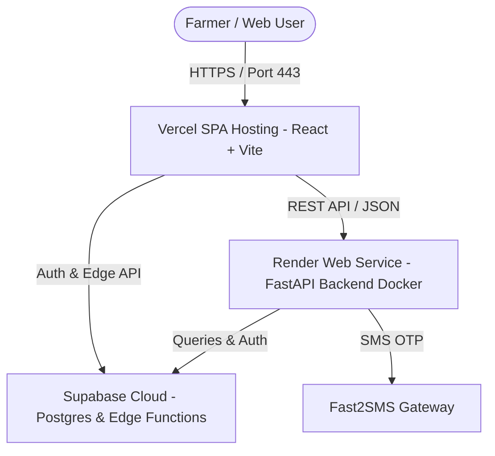
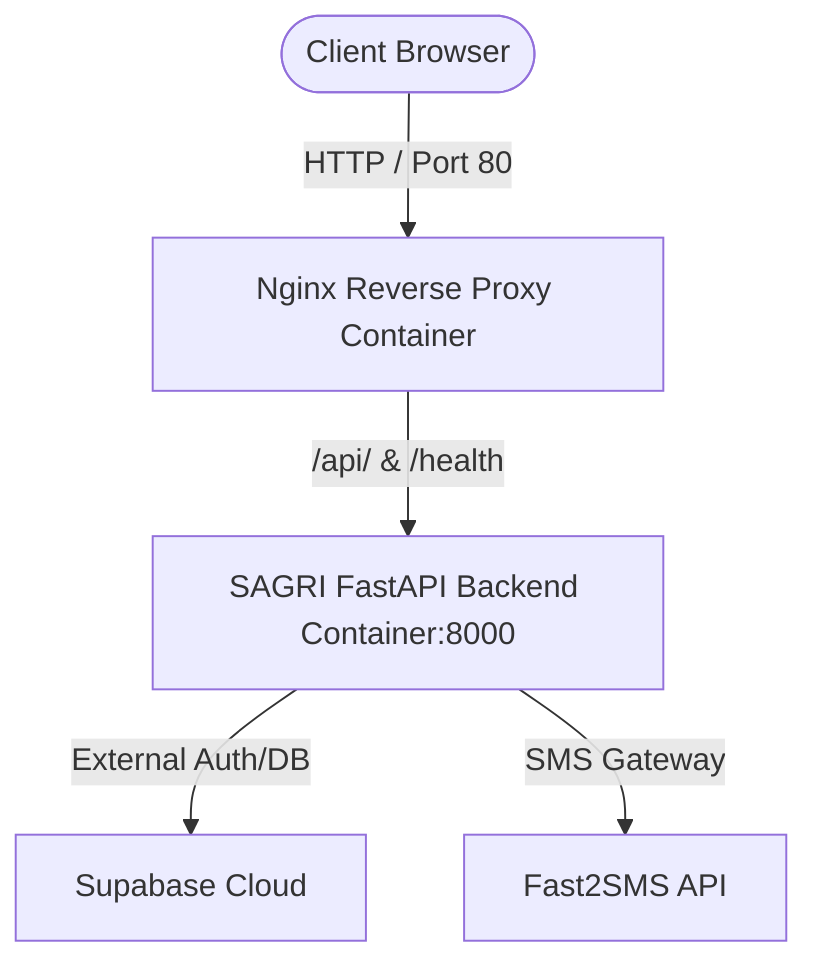

# 📐 SAGRI Architecture Documentation

SAGRI (Krishi Sahayak) is an AI-Powered Smart Agriculture Platform with a decoupled full-stack architecture.

---

## ☁️ Model 1: Cloud-Native Architecture (Free Tier)



### Components:
- **Frontend SPA**: React (Vite) hosted on Vercel (`https://sagri.vercel.app`)
- **Backend API**: Python FastAPI hosted on Render Web Service via Docker (`https://sagri-ml-backend.onrender.com`)
- **Database & Auth**: PostgreSQL, Auth, and Edge Functions hosted on Supabase Cloud
- **ML Models**: MobileNetV2 (Disease), Prophet (Price), Random Forest (Crop), XGBoost (Risk) loaded in-memory on FastAPI container

---

## 🐳 Model 2: Self-Hosted Docker Compose Architecture



### Command to launch self-hosted stack:
```bash
docker-compose -f infra/docker/docker-compose.yml up -d
```
